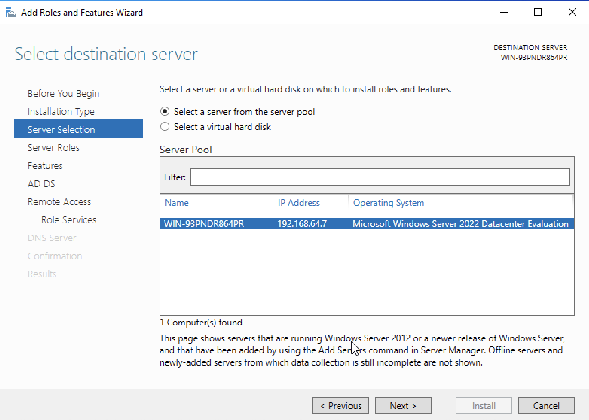
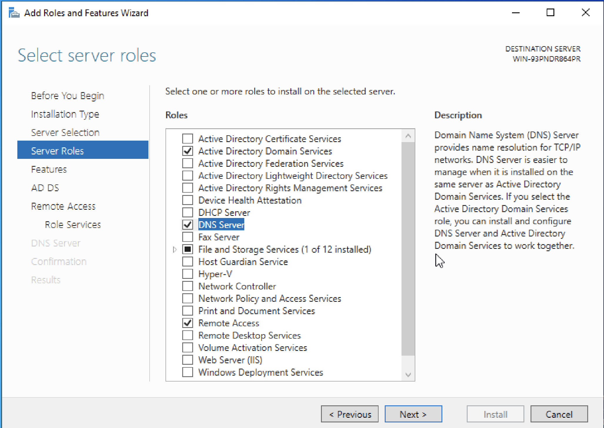
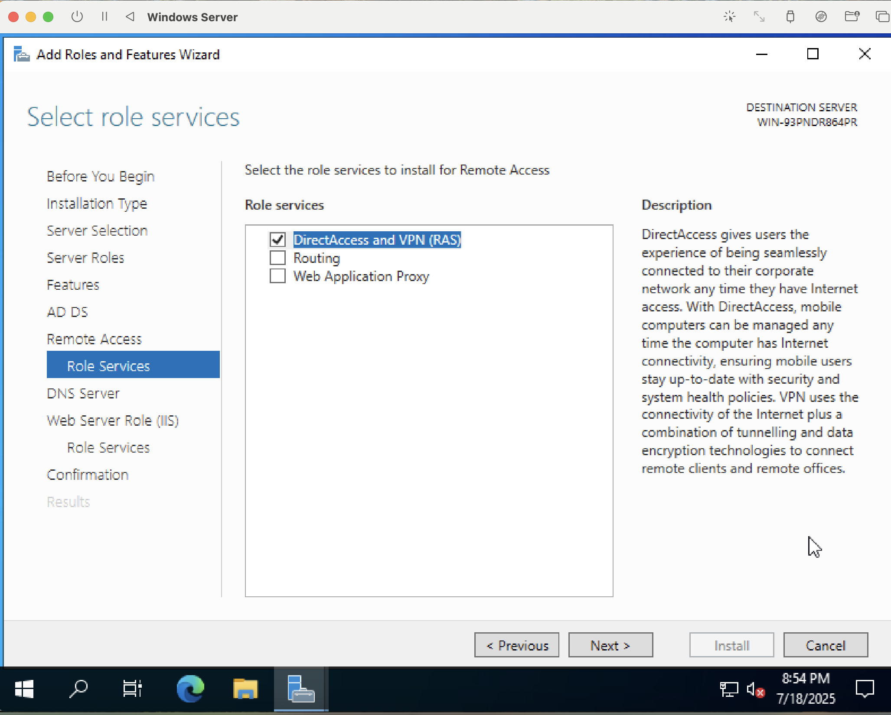
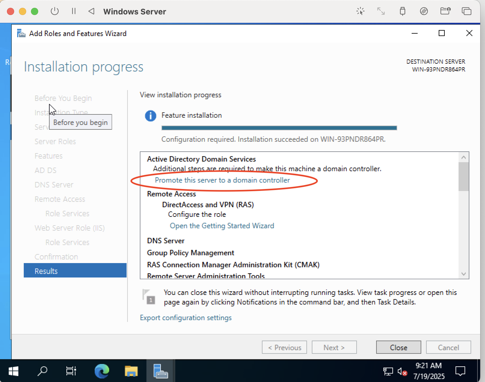
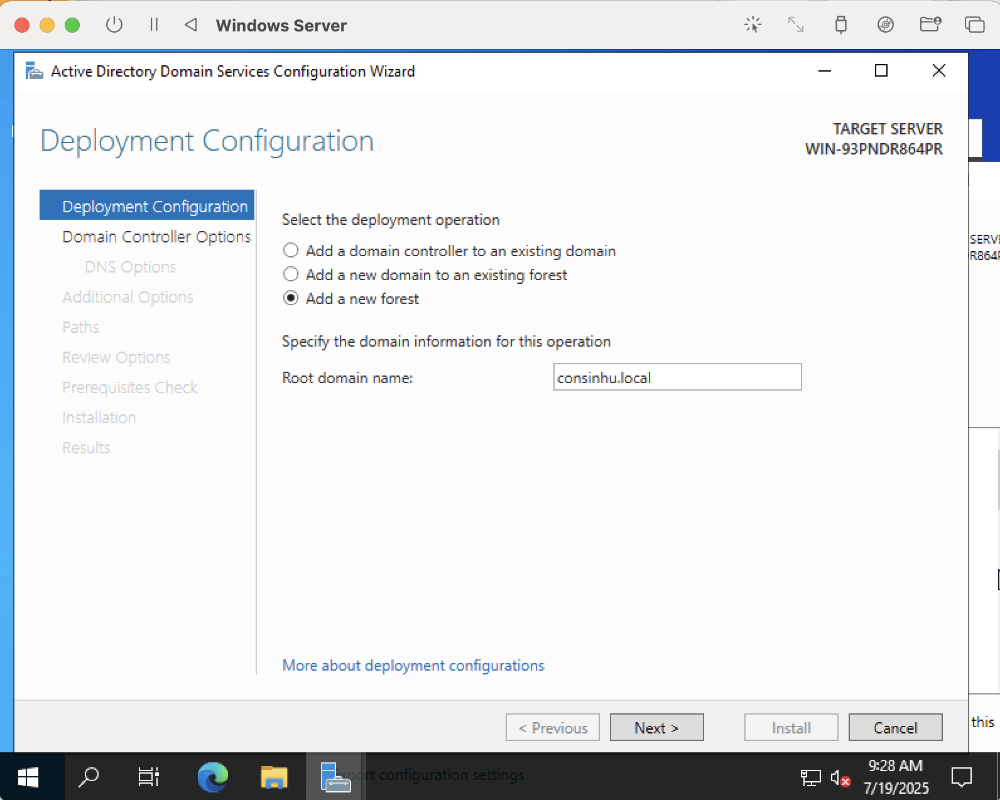
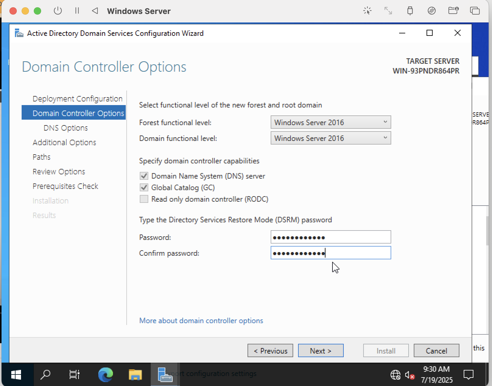
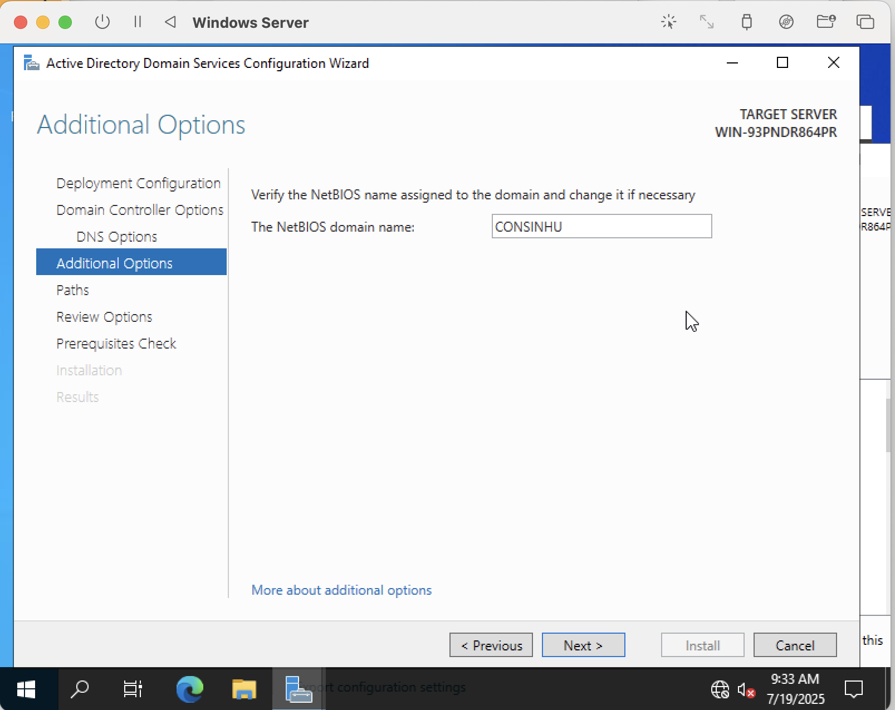
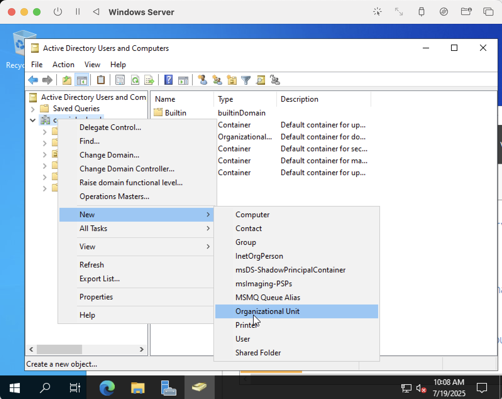
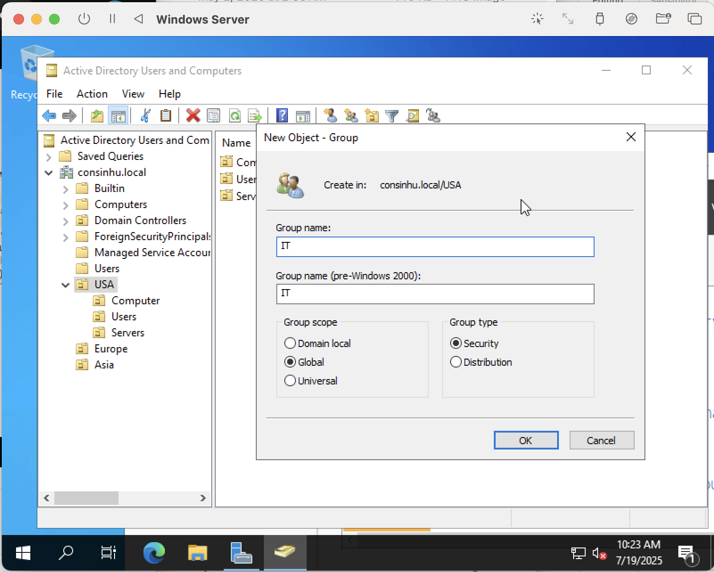

# Active Directory Installation 

 

<h1>Active Directory Deployed in UTM on a macOS Host</h1>

In this part of my Active Directory HomeLab, I worked on outlining the steps of implementing an on-premises Active Directory within a macOS Virtual Machine through UTM.

As someone who was new to Active Directory before this project, I learned that tools like Active Directory allow for centralized user and device management, resource sharing, and seamless remote access onto a singular virtual desktop.
 

Active Directory is also popular and helpful industry-wise  due to the fact that the number of end users often outweighs the number of resources available. It is also an important security tool that allows IT administrators to easily manage access and permissions for a given organization.

<h2>Environments and Technologies Used</h2>

- UTM Virtual Machines
- Active Directory Domain Services

<h2>Operating System Used</h2>

- Windows Server 2016

<h2>Basic Deployment and Configuration Steps</h2>

- Windows Server Setup
- Promoting server to Domain Controller
- Create Active Directory domain
- Create organizational units (OUs) for different departments
- Create user accounts and groups within OUs

**Setting up Windows Server VM**

 To preface, I am working on an M1 Mac. If you have an Intel, you will need to follow different steps. I recommend referencing the article at this link: https://tcsfiles.blob.core.windows.net/documents/AIST3720Notes/WindowsServeronanIntelMac.html 

  

We will need to find installation media or an ISO image corresponding to a Windows Server OS. I found mine at the official Microsoft Windows page, but just make sure to find a reliable one because this is getting downloaded on your main OS. Anything from 2016 onwards should work fine.

Start by opening UTM. If you do not have UTM, you can find it online or in the App store on your Mac. I would also create a separate folder to store all your related downloads for easy access. In UTM, choose Create a New Virtual Machine ( File > New from the menu or clicking the plus sign next to existing VMs also work) and choose Emulate, not Virtualize. This is because the M1 chip is unable to fully virtualize a Windows Server architecture.

Here's where things start to get a little complicated. You will need to select an ISO image to boot. I will explain more in later steps, but for now just select the file installed earlier and continue through the setup steps.

Accept the defaults for Hardware and Storage settings. Just click Continue for each wizard.

If you'd like, you can enable a Shared Directory, which will be a folder already present on your Mac system that will be made available in your emulated Windows Server. This is optional. Click continue after your choice is made.

In Summary, make sure to rename the emulated VM to something relevant like Windows Server 2016. No other changes need to be made. Click Save.

We can now start installing Microsoft Server OS. Click Play button in UTM or right-click VM to choose Run. UTM's icon will pop up alone for a bit before leading to a prompt saying "Press a key to boot from the CD/DVD". Act quickly and press Enter (or a key other than the space bar) within a few seconds before the time is up. If you miss this window, don't worry! Just restart your VM using menu options and try again. Once successful, you will see a Microsoft Server OS Setup window. Either accept or change the parameters based on your preferences. Then click Next.

The setup will prompt for a product key; just click "I don't have a product key". The next screen will ask you to select the type of operating system you want installed. For this page, you'll want to pick something that includes Desktop Experience or else you'll get only the command prompt when you open the server. Click Next.

Now, you might end up with an error screen saying "Windows cannot find the Microsoft software license terms" after hitting Next. This issue typically arises when an installation media is selected durin the initial VM creation stage when it should be added after. It's just confusing because in UTM, users are required to select an ISO prior to booting the VM, but there's a relatively quick and easy fix. First, in the top right corner of the VM window, find the small circle icon and eject the ISO. This will cause the VM to be unable to display anything, but you can add back in the ISO by right clicking on the VM in the list format after it's stopped and going to Edit > IDE drive > Browse. Find the file containing the installation media and select it. Then, repeat the last two steps before this paragraph and you should be able to get back to where we left off.

This time after selecting the proper OS type, you should be met with a notice and license terms screen. Check the accept box and click Next.

On the next screen, choose Custom Install since we are building from scratch not upgrading. Once you hit the Custom option, the setup wizard will ask for where you want to install your OS. Just keep it at the default location. For me, it was also the only option. Click Next.

Windows will begin the installation process. It will take likely half-an-hour or longer so you can either use your computer to do other things during this or leave it alone. Just make sure you do not shut it down or put it to sleep during this time.

After the installation is complete, the entire VM will restart and re-display the "Press a key to boot from CD/DVD". Do NOT hit a key this time and just wait for the system to start up with the newly installed Windows Server. In a bit, you will be prompted for a password for the built-in administrator (you) to use to sign in. Hit Finish.

VM will take you to the lock screen where Windows Server will require you to Ctrl+Alt+Delete to unlock. Since we are on a Mac, the Alt key will be replaced with Option. Make sure to also click into the VM window before entering the key combination. After you bypass the lock screen, enter you Admin password and press enter.

Server Manager will automatically start launching and we can move on to the second and third parts of this activity. If there is a network discovery popup, select the option that makes your server discoverable.

**Promoting Server to Domain Controller and Creating an Active Directory Domain**

Once Server Manager is finished launching (it is going to take a while because everything is a slower and more laggy on an emulated VM), navigate to the Manage tab and select Add Roles and Features. A wizard will pop up afterwards and we will select destination server, server roles, and role services as well as promote the server as a domain controller.

_This step will load for while once a destination server is selected. Do NOT click the red "X" that shows up in the top right corner. Clicking it will cancel the loading process_

_Make sure to enable all the same roles and services as I have in the two screenshots above in order for Active Directory to function properly. For any other pages, just hit next all the way through until you get to Results_

_In the Results page, hit Install. When installation is finished, do NOT close the window. In order to promote our server to domain controller, click on the blue text under Active Directory Domain Services that I've circled in red._

_Active Directory Domain Services Configuration Wizard should open up. In Deployment Configuration, toggle the Add a new forest option and input your root domain name (make something up in the format "example.local"). You will also be prompted for a password to your directory services in Domain Controller Options. Afterwards, in Additional Options, make sure to verify your NetBIOS domain name, which would be the part of the root domain before .local_

**OUs, Groups, and Users in Active Directory**

System will restart after finishing the previous steps for installing Active Directory. Once you're back in, you can locate the Active Directory services we installed in the startup menu on Windows Server. Click into Active Directory Users and Computers.

To create OUs or organizational units, groups, and users, I've included some screenshot examples.

When IT people say OU, they're abbreviating for organizational unit, which you probably already caught on to. OUs are basically container-like structures that carry different types of objects such as users, groups, computers, servers, etc. In a real world setting, OUs can be used to categorize departments based on geography, function, or people.

Groups can be slightly more complicated and there are a a few considerations that must be made before creating a group, specifically group scope and group type. Group Scope refers to the extent to which a group's members and permissions can be applied within a domain. There are three main levels which are Universal, Global, and Domain (local).

There's also Group Type. Security Group Types are used to assign permissions to shared resources while Distribution Group Types are mainly used for email lists and cannot be used to assign permissions.

